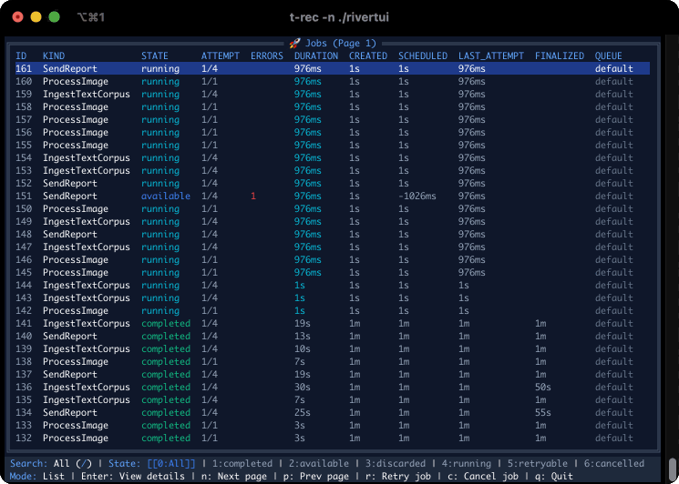

# rivertui

A terminal-based user interface and CLI for [River Queue](https://riverqueue.com/) - monitor and manage your jobs from the command line.

<div align="center">
  
</div>

## Installation

```bash
go install github.com/almottier/rivertui@latest
```

## Usage

```bash
export RIVER_DATABASE_URL="postgres://localhost:5432/myapp"
rivertui
```

### Command Line Options

| Flag | Environment Variable | Description | Default |
|------|---------------------|-------------|---------|
| `--database-url` | `RIVER_DATABASE_URL` | PostgreSQL connection string | Required |
| `--refresh` | - | Refresh interval | `1s` |
| `--job-id` | - | Start in details view for specific job ID | - |
| `--kind` | - | Start with kind filter applied | - |

### Example

```bash
# Basic usage
rivertui --database-url "postgres://localhost:5432/myapp"

# Custom refresh rate
rivertui --database-url "postgres://localhost:5432/myapp" --refresh 2s

# Start viewing specific job
rivertui --database-url "postgres://localhost:5432/myapp" --job-id 12345

# Start with kind filter applied
rivertui --database-url "postgres://localhost:5432/myapp" --kind "SendEmailJob"

# Using environment variable
export RIVER_DATABASE_URL="postgres://localhost:5432/myapp"
rivertui
```

## Features

- **Real-time job monitoring** with auto-refresh
- **Job state filtering** (available, running, completed, discarded, etc.)
- **Job kind filtering** and search
- **Job details view** with full arguments, metadata, and error information
- **Job operations**: retry and cancel jobs
- **Pagination** for large job lists
- **Queue management**: view, pause, and resume queues
- **Keyboard-driven navigation**

## Keyboard Shortcuts

| Key | Action |
|-----|--------|
| `Enter` | View job details |
| `/` | Search by job kind or jump to job ID |
| `0-7` | Filter by job state (0=All, 1=Completed, 2=Available, etc.) |
| `Ctrl+Q` | View queues |
| `r` | Retry selected job |
| `c` | Cancel selected job |
| `n` | Next page |
| `p` | Previous page |
| `p` | Pause selected queue |
| `r` | Resume selected queue |
| `q` | Quit |

## Requirements

- Go 1.21+
- River Queue 0.5.0+
- PostgreSQL database with River Queue tables
- Terminal with color support

## Color Themes & Customization

Custom color schemes can be set via the following `RIVER_THEME_` prefixed environment variables using hex color strings:

```bash
# Example: catppuccin (mocha)
export RIVER_THEME_PRIMARY="#89b4fa"
export RIVER_THEME_SECONDARY="#b4befe"
export RIVER_THEME_TERTIARY="#74c7ec"
export RIVER_THEME_BACKGROUND="#1e1e2e"
export RIVER_THEME_BORDER="#585b70"
export RIVER_THEME_WARNING="#fab387"
export RIVER_THEME_INFO="#89dceb"
export RIVER_THEME_SUCCESS="#a6e3a1"
export RIVER_THEME_ERROR="#f38ba8"
export RIVER_THEME_AVAILABLE="#74c7ec"
export RIVER_THEME_CANCELLED="#f9e2af"
export RIVER_THEME_RETRYABLE="#cba6f7"
export RIVER_THEME_SCHEDULED="#bac2de"
export RIVER_THEME_TITLE="#f5e0dc"
export RIVER_THEME_CONTRAST_PRIMARY="#cdd6f4"
export RIVER_THEME_CONTRAST_SECONDARY="#313244"
export RIVER_THEME_SELECTED_BG="#585b70"

# you can also use a boolean flag to make the background transparent
export RIVER_THEME_TRANSPARENT_BG=true
```

Similarly, the follwing environment variables (prefixed with `RIVER_COLOR_`) can be used to override theme colors for individual UI components:

```bash
export RIVER_COLOR_PRIMITIVE_BACKGROUND
export RIVER_COLOR_CONTRAST_BACKGROUND
export RIVER_COLOR_MORE_CONTRAST_BACKGROUND
export RIVER_COLOR_BORDER
export RIVER_COLOR_TITLE
export RIVER_COLOR_GRAPHICS
export RIVER_COLOR_PRIMARY_TEXT
export RIVER_COLOR_SECONDARY_TEXT
export RIVER_COLOR_TERTIARY_TEXT
export RIVER_COLOR_INVERSE_TEXT
export RIVER_COLOR_CONTRAST_SECONDARY_TEXT
export RIVER_COLOR_JOB_LIST_SELECTED_BG
export RIVER_COLOR_JOB_LIST_SELECTED_FG
export RIVER_COLOR_JOB_LIST_BORDER
export RIVER_COLOR_JOB_LIST_TITLE
export RIVER_COLOR_JOB_LIST_BG
export RIVER_COLOR_JOB_DETAILS_BORDER
export RIVER_COLOR_JOB_DETAILS_TITLE
export RIVER_COLOR_JOB_DETAILS_BG
export RIVER_COLOR_STATUS_BAR_BG
export RIVER_COLOR_KIND_FILTER_LABEL
export RIVER_COLOR_KIND_FILTER_BORDER
export RIVER_COLOR_KIND_FILTER_TITLE
export RIVER_COLOR_KIND_FILTER_BG
export RIVER_COLOR_KIND_FILTER_FIELD_BG
export RIVER_COLOR_CONFIRMATION_MODAL_BORDER
export RIVER_COLOR_CONFIRMATION_MODAL_TITLE
export RIVER_COLOR_CONFIRMATION_MODAL_BG
export RIVER_COLOR_QUEUE_LIST_SELECTED_BG
export RIVER_COLOR_QUEUE_LIST_SELECTED_FG
export RIVER_COLOR_QUEUE_LIST_BORDER
export RIVER_COLOR_QUEUE_LIST_TITLE
export RIVER_COLOR_QUEUE_LIST_BG
export RIVER_COLOR_JOB_STATE_AVAILABLE
export RIVER_COLOR_JOB_STATE_RUNNING
export RIVER_COLOR_JOB_STATE_COMPLETED
export RIVER_COLOR_JOB_STATE_DISCARDED
export RIVER_COLOR_JOB_STATE_CANCELLED
export RIVER_COLOR_JOB_STATE_RETRYABLE
export RIVER_COLOR_JOB_STATE_SCHEDULED
export RIVER_COLOR_QUEUE_TABLE_HEADER
export RIVER_COLOR_JOB_TABLE_HEADER
export RIVER_COLOR_QUEUE_NAME
export RIVER_COLOR_QUEUE_STATE_PAUSED
export RIVER_COLOR_QUEUE_STATE_ACTIVE
export RIVER_COLOR_QUEUE_TIMESTAMP
export RIVER_COLOR_QUEUE_TIMESTAMP_BG
export RIVER_COLOR_JOB_ID
export RIVER_COLOR_JOB_KIND
export RIVER_COLOR_JOB_ATTEMPT
export RIVER_COLOR_JOB_ERROR_COUNT
export RIVER_COLOR_JOB_ERROR_COUNT_BG
export RIVER_COLOR_JOB_TIMESTAMP
export RIVER_COLOR_JOB_TIMESTAMP_BG
export RIVER_COLOR_JOB_QUEUE
export RIVER_COLOR_JOB_DURATION_FINALIZED
export RIVER_COLOR_JOB_DURATION_ACTIVE
export RIVER_COLOR_JOB_DURATION_EMPTY
export RIVER_COLOR_JOB_DURATION_EMPTY_BG
```

## License

MIT
